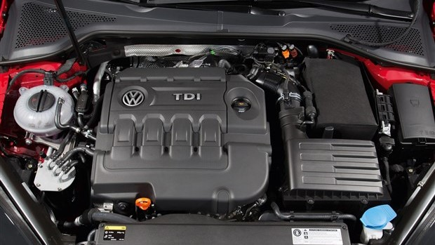
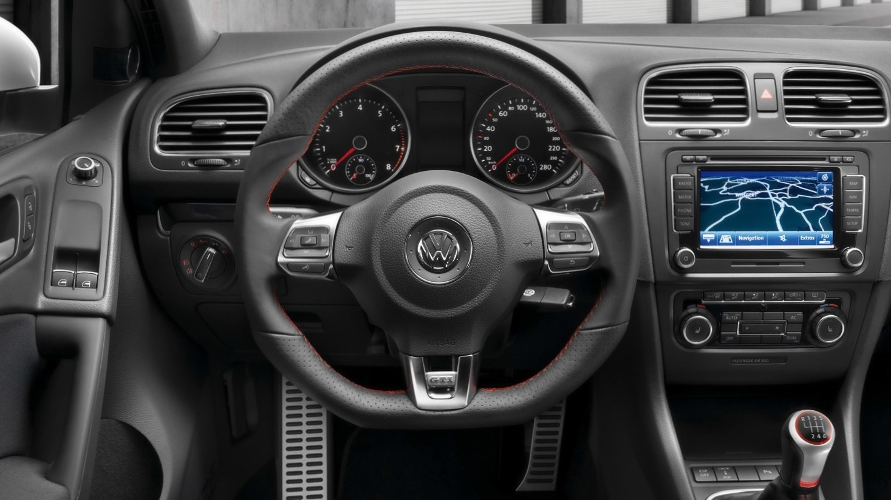
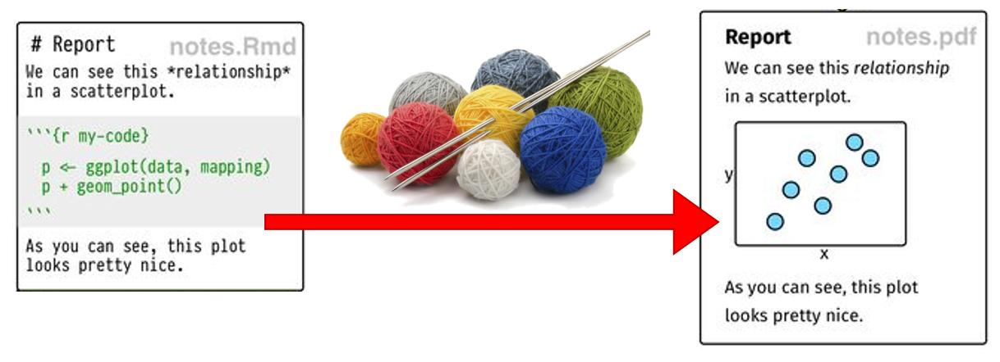
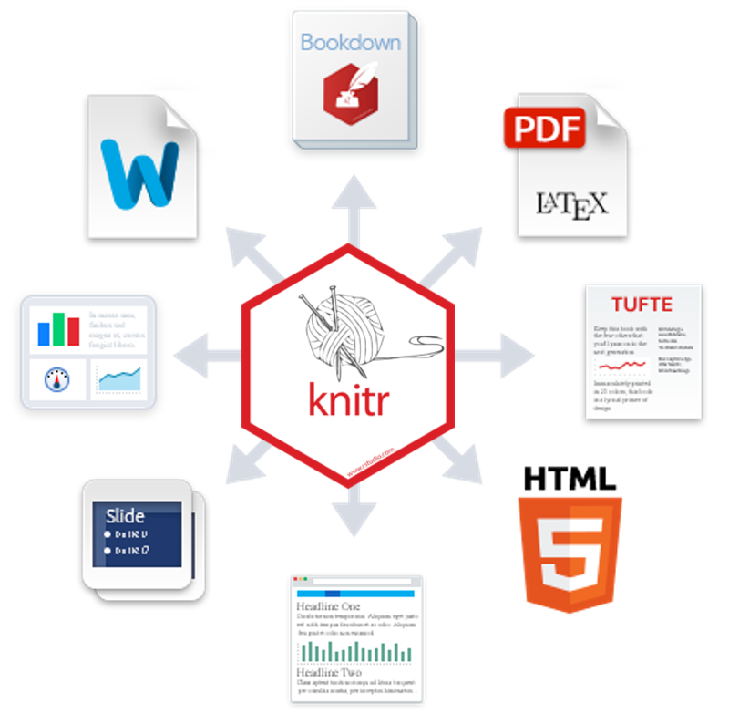

# Overview

```{r, include=FALSE, comment=FALSE}
library(tidyverse, quietly = TRUE)
library(kableExtra)
```


Before we get busy downloading and installing the actual software, here is the big picture.

----------------------

## R vs. R Studio

```{r, echo=FALSE}
data.frame("R"        = c("{width=100px}",
                          "Programing Language",
                          "Install and Ignore",
                          "Engine", 
                          "{width=500px}"),
           "R Studio" = c("{width=200px}",
                          "Interface Program",
                          "Interact with Constantly",
                          "Dashboard",
                          "{width=500px}")) %>% 
  kableExtra::kable(col.names = c("R", "R Studio"),
                    align = "c")
```


> Many users think of $R$ as a statistics system. We prefer to think of it of an environment within which statistical techniques are implemented. $R$ can be extended (easily) via packages. There are about eight packages supplied with the $R$ distribution and many more (over 10,000) are available through the $CRAN$ family of Internet sites covering a very wide range of modern statistics.
>
> [www.r-project.org](https://www.r-project.org/about.html)


Where as $R$ is a *programming language* that runs computations, $R Studio$ is an *integrated development environment (IDE)* that provides an interface by adding many convenient features and tools. So the way of having access to a speedometer, rearview mirrors, and a navigation system makes driving much easier, using **$RStudio’s$ interface makes using $R$ much easier** as well.  - [Chester Ismay and Albert Y. Kim](https://ismayc.github.io/moderndive/index.html)


```{block, type="rmdlink"}
For a more in-depth discussion on the difference between $R$ and $R Studio$ IDE, watch this [DataCamp video (2m52s)](https://campus.datacamp.com/courses/working-with-the-rstudio-ide-part-1/orientation?ex=1).
```

----------------------

## R Markdown vs. R Notebook

```{r, echo=FALSE}
data.frame(Rmd = c("",
                   "Plain text that includes shorthand notation to denote formatting, instead of relying on a text editor program display (MS Word).  Files are saved with the `.Rmd` extension."),
           nb = c("{width=225px}",
                  "A specific kind of `.Rmd` file in which the code chunks may be interactively executed/run onscreen and the results/output are shown directly below each code chunk.")) %>% 
  kableExtra::kable(col.names = c("R Markdown", "R Notebook"),
                    align = "c")
```

 
$R Markdown$ documents are fully reproducible. Use a productive **notebook** interface to **weave together narrative text and code** to produce elegantly formatted output. Use multiple languages including $R$, $Python$, and $SQL$ [@R-rmarkdown].


```{block type='rmdlink', echo=TRUE}
**More details at the R Studio website:** [R Markdown, lesson 1 ](https://rmarkdown.rstudio.com/lesson-1.html) and [R Notebooks](https://rmarkdown.rstudio.com/r_notebooks)
```


----------------------

## knit-R



With the click of a button, the `knitr` package will convert a $R notebook$ (`.Rmd`) to an intermediary *Markdown* file with the extension `.md`, which $R Studio$ will further transform to various final file types, including [@xie2015]: 

* `.pdf` using $LaTeX$ *(beautiful)*

* `.html` using another package called $markdown$ *(highly viewable)*   

* `Word` document using Pandoc *(probably be ugly)*


{width=500px}


`knitr` is an engine for dynamic report generation with $R$. It is a package in the statistical programming language $R$ that enables integration of **R code** into $LaTeX$, $LyX$, $HTML$, $Markdown$, $AsciiDoc$, and $text$s documents [@R-knitr].


```{block type='rmdlink', echo=TRUE}
The professionals ar $R Studio$ show it better at their [website](https://rmarkdown.rstudio.com/index.html).
```


-------------

## More Indepth FAQs 


```{block type='rmdlink', echo=TRUE}
**Helpful Websites:** [Quick R: Basic Statistics](https://www.statmethods.net/stats/index.html) and [Introduction to R](https://libguides.library.kent.edu/statconsulting/r)
```


### What is R ? {-}

> $R$ is a language and environment for statistical computing and graphics. [@R-base]

$R$ provides a wide variety of **statistical** *(linear and nonlinear modelling, classical statistical tests, time-series analysis, classification, clustering, ...)* and **graphical** techniques, and is highly extensible. The $S$ language is often the vehicle of choice for research in statistical methodology, and $R$ provides an Open Source route to participation in that activity.

One of $R$’s strengths is the ease with which well-designed publication-quality plots can be produced, including mathematical symbols and formulae where needed. Great care has been taken over the defaults for the minor design choices in graphics, but the user retains full control.


### What is R Markdown ? {-}

According to [R Studio](www.rstudio.com):

> "R Markdown is a format that enables easy authoring of reproducible web reports from R. It combines the core syntax of Markdown (an easy-to-write *plain text* format for web content) with embedded *$R$ code chunks* that are run so their output can be included in the final document".


### What is Dynamic Reporting? {-}

From [Penn State Statistics](https://onlinecourses.science.psu.edu/statprogram/markdown): 

The traditional way to write a report:

1. Run your analysis in software, like SPSS or R and manually save our output
    * *i.e. saving the ANOVA table or using `pdf()` to save the graphs*  


2. Type your your description and interpretation in a text editor like *Word*
    * *either drag/drop tables and figures, or worse copy-paste and retype all the numbers*


A report written in this way can be problematic.  For instance, imagine your *Mentor/collaborator/journal reviewer*  telling you that they want to use a sub-sample instead of the entire sample. Or to include a nother variable.  You would have to redo all of your work!! 

Therefore, in this way **dynamic also means reproducible**, in the sense that people who get the file from you can reproduce the entire work in the report.


### Is this a popular method for creating reports? {-}

YES!

```{block type='rmdlink', echo=TRUE}
Check out [Rpubs](http://rpubs.com/). This website shares lots of documents written in the way we will introduce below.
```


