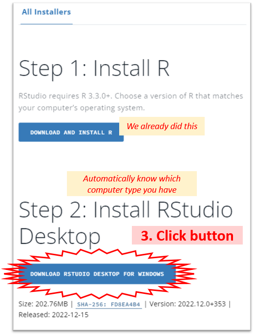

# Install Software


You will need to install both $R$ and $R Studio$, but $\LaTeX$ is optional.


## The R Programing Language

> The **“Comprehensive R Archive Network” (CRAN)** is a collection of sites which carry identical material, consisting of the $R$ distribution(s), the contributed extensions, and documentation for $R$.  From $CRAN$, you can obtain the latest official FREE release of BASE $R$.

```{block type='rmddownload', echo=TRUE} 
Go to: [www.r-project.org](http://www.r-project.org)   

* Choose a CRAN mirror close to your geographical location    
* Select **base** $R$ for your computer *(Windows, Mac, ect.)*    
* Once it is downloaded, run the instalation.    
* The defaults are good...don't change them...just keep clicking *'Next'*    
```


```{block type='rmdlink', echo=TRUE}
The $R$ Project website has an extensive [FAQ](https://cran.r-project.org/doc/FAQ/R-FAQ.html)
```


```{block type='rmdlightbulb', echo=TRUE}
Each new release of $R$ is given a name that references a Peanuts strip or film.  Read some of the past names and find out where they came from: [blog post](https://livefreeordichotomize.com/2017/09/28/r-release-names/)
```

---------------------------------

## The R Studio IDE


```{block type='rmddownload', echo=TRUE}
Go to: [www.rstudio.com](http://www.rstudio.com) 

* Select the FREE Open Source **Desktop** Edition of $R Studio$
* The defaults are good...don't change them...just keep clicking *'Next'* 
```





```{block type='rmdlink', echo=TRUE}
$R Studio$ has an entire [online learning library](https://www.rstudio.com/online-learning/).  It is full of helpful links and resources for R programing, R markdown, and statistics.
```

---------------------------------

## TeX (optional)


```{block type='rmdlightbulb', echo=TRUE}
$\TeX$ or $LaTeX$ is a typesetting or formatting system that is commonly used in printing and publishing, especially anything with formulas (see https://texfaq.org/FAQ-whatTeX).  It is NOT NEEDED to run $R$, but $R Studio$ must have access to it in order to `knit` a $R Notebook$ into a `.pdf` file.
```

### Mac - use `MacTeX`


```{block type='rmddownload', echo=TRUE}
Go to:  [http://tug.org/mactex/](http://tug.org/mactex/)     

* Download (5+ min) to a folder and them double click on the **PKG file**
* Follow the installation instructions.
* You don't need to open anything after MacTeX is finished installing. 
```


### Windows - use `MikTeX`

```{block type='rmddownload', echo=TRUE}
Go to: [http://miktex.org/download](http://miktex.org/download)     

* Pick the latest version of the **Net Installer**, not the Basic!     
* You need the full version 64-bit is better, if you have a 64-bit machine    
* When your download is complete, run the downloaded installer.     
* Windows may ask you if you want to *“allow this app from an unknown publisher to make changes to your PC”*. If it does, make sure to click **Yes!**    
* This is the slowest part...
```


### Use `tinytex` package
 

```{block type='rmdconstruct', echo=TRUE}
**ADD SECTION:** new package alternative to using full TeX
```