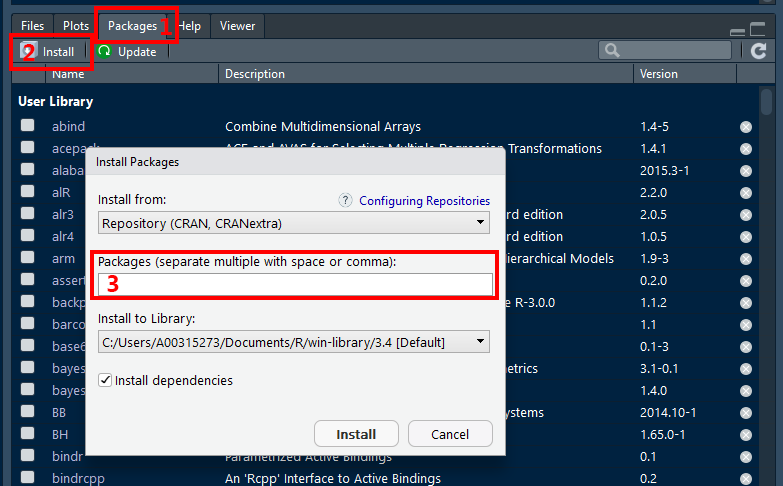

# Install Packages

We describe packages and their management

-----------

## What are packages

> **R packages** are collections of functions and data sets developed by the community. They increase the power of **R** by improving existing base **R** functionalities, or by adding new ones.

More information may be found here:  https://www.datacamp.com/community/tutorials/r-packages-guide 


-----------

## INSTALL packages (via the user interface)

> You only need to INSTALL packages ONCE per computer.


In **R Stuido**:

1. Click on the **Packages** tab the panel with the most tabs
2. Click on the word **Instsall** just under and to the left of the tab
2. In the **Packages** box, type in the name of the packages you would like to download.  You can do several at once, just seperate them with multiple spaces or a comma.

*Note: Leave the installation library path as the default.  Also, make sure the box for 'Installing dependencies' is checked.*




-----------

## LOAD packages (via $R$ code) 

> You will need to LOAD packages in EVERY SESSION you want to use them in.

```{r, eval=FALSE}
library(tidyverse)
```

Please don’t get confused: `library()` is the command used to **load a package**, and it refers to the **place** where the package is contained, usually a folder on your computer, while a package is the collection of functions bundled conveniently.

Maybe it can help a quote from **Hadley Wickham**, Chief data scientist at RStudio, and instructor of the *“Writing functions in R”* DataCamp course (December 8, 2014):

> "a package is a like a book, a library is like a library; you use `library()` to check a package out of the library"

Here is link to an AWSOME ['cheat sheet' for begginers working with the `tidyverse` package](http://datacamp-community.s3.amazonaws.com/e63a8f6b-2aa3-4006-89e0-badc294b179c).  I highly suggest checking it out.

More 'cheat sheets' are available under the "Help" menu option in **R Studio**


-----------

## Updating packages


