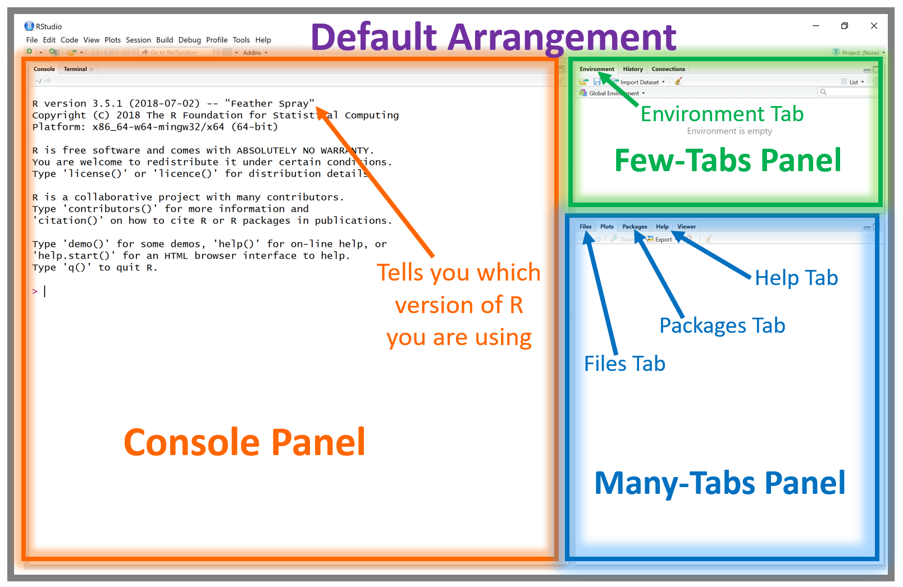
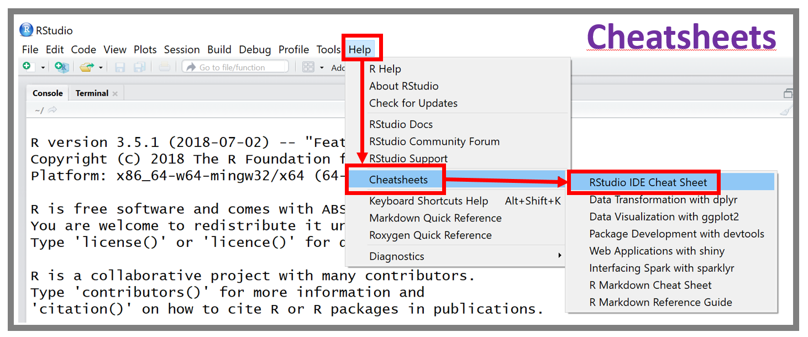
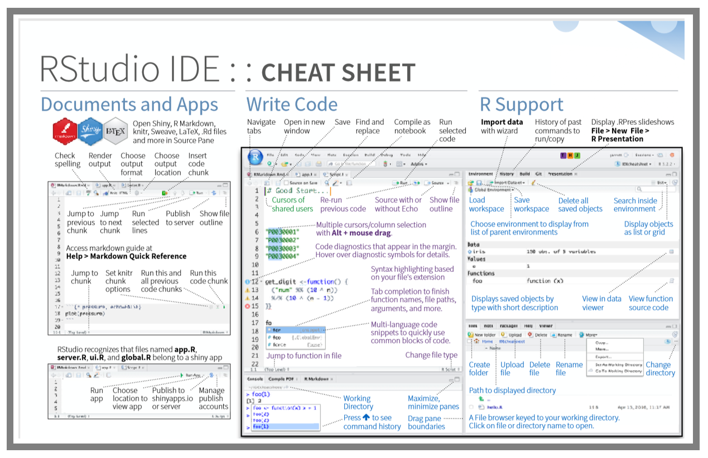
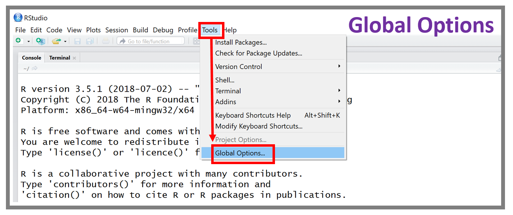
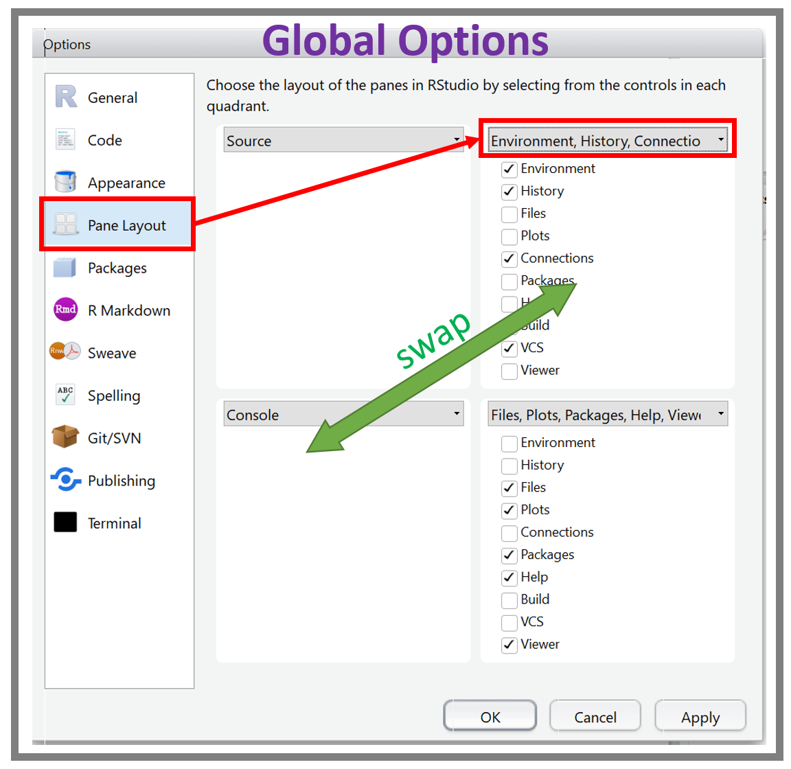
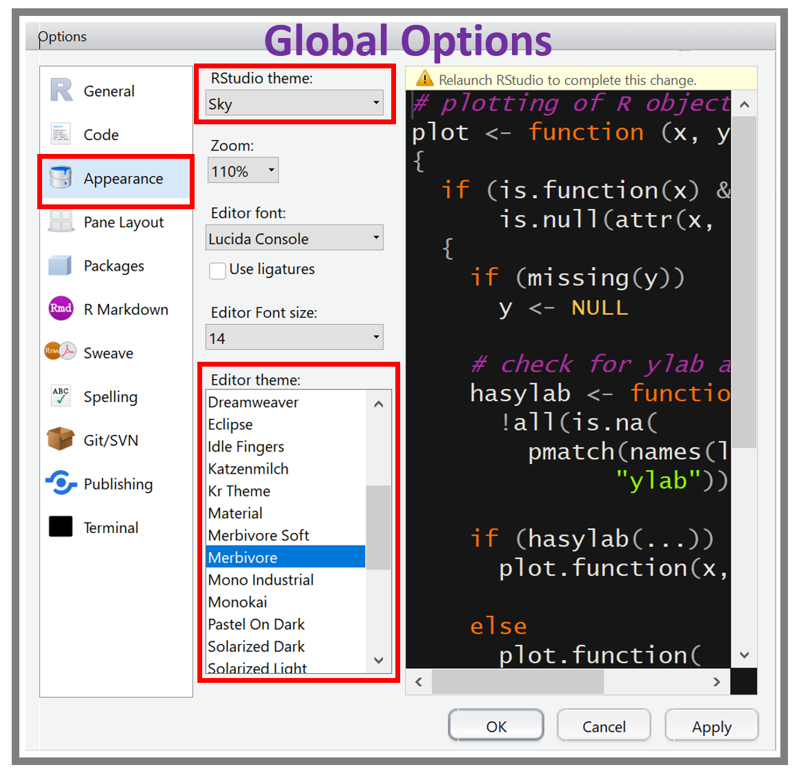
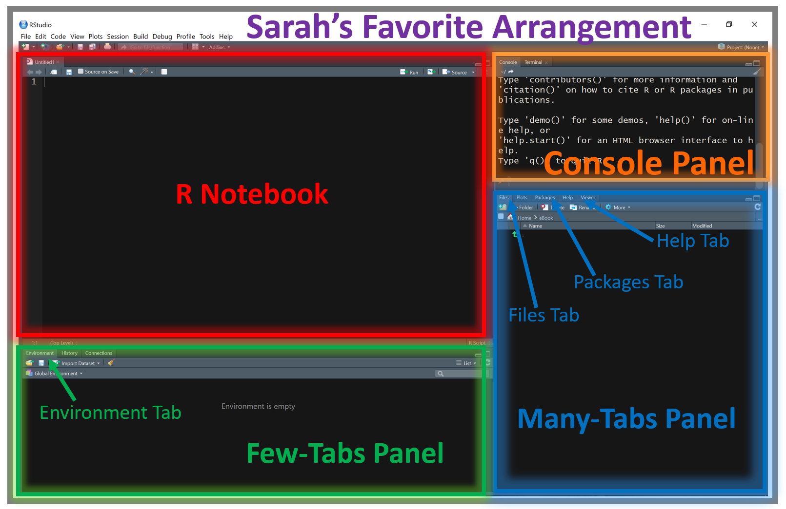

# Workspace Orientation


Get a feel for the lay of the land.

Before starting to use `RStudio`, let's run the following code in the console (just copy and paste it): `usethis::use_blank_slate()`. This makes it so whenever you close and then reopen `RStudio` you start with a blank environment. Don't worry, all your code is still saved in your `.rmd` or `.r` file!


```{block type='rmdconstruct', echo=FALSE}
**ADD SECTION:** This chapter has not been started yet. 
```

-----------------------

## Default Window Arrangement

{width=600px}


-----------------------

## Cheatsheets

{width=600px}


{width=600px}


-----------------------

## Global Options Menu

{width=600px}


### Pane Layout


{width=400px}


### Appearance


{width=400px}


{width=600px}


-----------------------

## Various Tabs


### Files

The files tab will by default show your working directory (the folder that is "home base" for your R session).

### Packages

These show all the packages you currently have installed. Many come standard with `R` but others listed could have been installed by you.

### Help 

We will use this tab a lot to look up how to use functions that maybe we are less familiar with.

### Environment

This shows the "objects" (usually data) that `R` knows is available for you to currently use. If nothing is in there, then you'll need to import data or other stuff you want to work with. This will be discussed much more later on.


