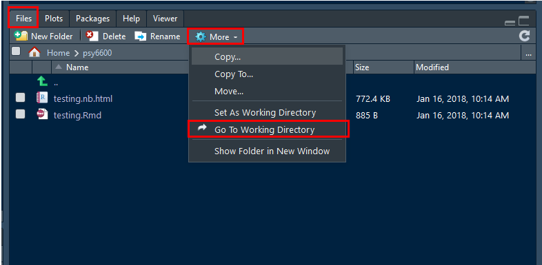

# Notebook Workflow


## Create a New Notebook 


[R Markdown Codebook](https://bookdown.org/yihui/rmarkdown-cookbook/)


### YAML header

YAML: YAML Ain’t Markup Language

YAML is a human-readable data-serialization language. It is commonly used for configuration files and in applications where data is being stored or transmitted [Wikipedia: YAML](https://en.wikipedia.org/wiki/YAML)

A YAML header contains YAML arguments, such as “title”, “author”, and “output”, demarcated by three dashes (`—--`) to start and end.

[Example: YAML](https://bookdown.org/yihui/rmarkdown-cookbook/dynamic-yaml.html)


### Headers

[R Markdown Reference Guide](https://www.rstudio.com/wp-content/uploads/2015/03/rmarkdown-reference.pdf )


### Plain Text

Simply add text below the YAML header. To start a new paragraph, you will need to end your plain text line with two (2) spaces.


### Markup for Formatting


Bold: surround text with double astrics (`**`)  

Italics: surround text with single astric (`*`)


### Code Chunks

Top line: ` ```{r} `  

Bottom line: ` ``` `

[Example: Code chunk](https://bookdown.org/yihui/rmarkdown-cookbook/r-code.html)

---------------------------------

## Interact within a Notebook


### Run Code Chunks

Press the "Run" button to run a chunk

Key strokes:

Run highlighted section or a single bit of code:  

* Windows: `Ctrl` + `Enter`  

* Mac: `Cmnd` + `Enter`


Run an entire code chunk:  

* Windows: `Ctrl` + `Shift` + `Enter`  

* Mac: `Cmnd` + `Shift` + `Enter`  


### Keyboard Shortcuts

[Example: shortcuts](https://bookdown.org/yihui/rmarkdown-cookbook/rstudio-shortcuts.html)


### Chunk Options


Add specification after the `r` inside the `{r}` at the start of the code chunk:

[Examples: Chunk options](https://bookdown.org/yihui/rmarkdown-cookbook/chunk-options.html)

---------------------------------

## Knit a Notebook


### Storing all associated files 

If you are using any files, such as *datasets* or *images*, they need to be stored in the same folder location as the R Notebook (`.Rmd` file).

This folder location must be the **Working Directory** for the R Studio session.  If you opened your `.Rmd` notebook file by double-clicking on its name, then this should be the case.  


### Setting the working directory

To ensure that R Studio knows where to find the files, you can manually set the **Working Directory** through the menu:

* Click `Session`
* Select `Set Working Directory` by hovering your mouse over it
* Click on `To Source File Location`

{width=600px}


You can double check that you were successful by 

* Click on the `Files` tab in the many-tab panel
* Click on the button with the gear that says `More`
* Click `Go To Working Directory`

At this point you should see all the files that reside in the folder location where the open `.Rmd` files is also saved. 

{width=600px}


### Press Knit
