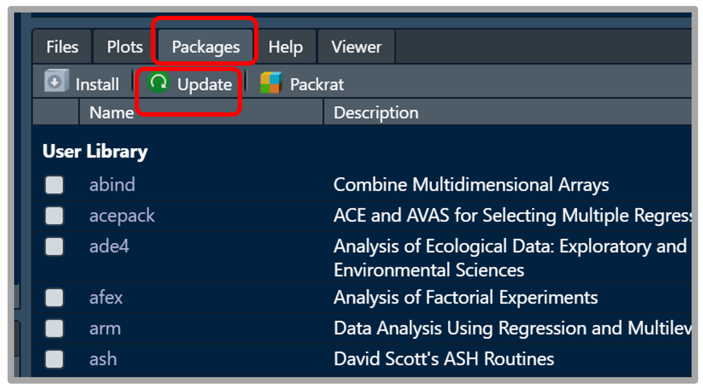

# Periodic Updates


Periodically you will need to update: R, R Studio, and your packages (but NOT $\LaTeX$).


## The R Programing Language


 ```{block type='rmdlightbulb', echo=TRUE}
**Updating `R`**

The best way to update is to go to the webpage and download/install as if you did not have R on your computer.  

You do NOT need to uninstall old versions of R on your computer.

Follow the directions in the previous chapter, [here](#installR).
```

---------------------------------

## The R Studio IDE

 
 ```{block type='rmdlightbulb', echo=TRUE}
 
**Updating `R Studio`**

1. Open the **R Studio** program on your computer
2. Click on the word **Help** on the menu at the top of the screen
3. Click on the option to **Check for Updates**
4. If there are updates avalible, folllow the directions.
```


---------------------------------

## All Your R Packages

 
 ```{block type='rmdlightbulb', echo=TRUE}
 
**Updating `R packages`**

1. Open the **R Studio** program on your computer
2. Click on the word **Packages** on the tab in the 'many-tab' panel
3. Click on the button to **Update**
4. Select the option to **Update All**

If you are asked any other things, your default anser is "yes", unless you get asked the exact same question repeatedly...in which case change to "no".
```

{width=600px}


