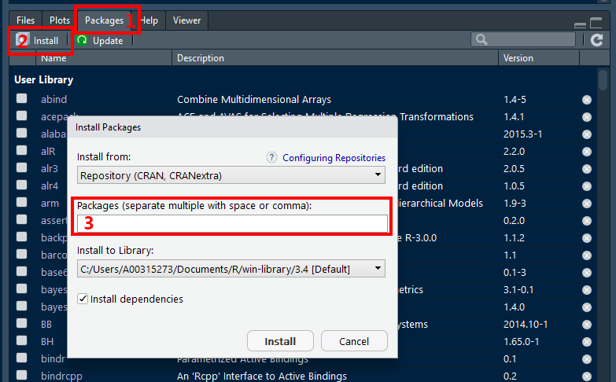

--- 
title: "Encyclopedia of Quantitative Methods in R"
subtitle: "Vol. 0: Setting up Your Computer"
author: "Sarah Schwartz & Tyson Barrett"
date: "Last updated: 2018-08-13"
site: bookdown::bookdown_site
output:
  bookdown::gitbook:
    split_bib: false
documentclass: book
bibliography: [book.bib, packages.bib]
biblio-style: apalike
link-citations: yes
github-repo: cehs-research/eBook_install
description: "Getting started with R and R Studio: installing software and package management."
---


# Introduction {-}

**Helpful Websites**

[Quick R: Basic Statistics](https://www.statmethods.net/stats/index.html)

\begin{rmdcomment}
Some text for this block. Some text for this block. Some text for this
block. Some text for this block. Some text for this block. Some text for
this block.
\end{rmdcomment}

-------------

**What is R?**

R is a language and environment for statistical computing and graphics. [@R-base]

R provides a wide variety of statistical (linear and nonlinear modelling, classical statistical tests, time-series analysis, classification, clustering, ...) and graphical techniques, and is highly extensible. The S language is often the vehicle of choice for research in statistical methodology, and R provides an Open Source route to participation in that activity.

One of R’s strengths is the ease with which well-designed publication-quality plots can be produced, including mathematical symbols and formulae where needed. Great care has been taken over the defaults for the minor design choices in graphics, but the user retains full control.

-------------------------

**What is R Markdown?**

According to [R Studio](www.rstudio.com):

> "R Markdown is a format that enables easy authoring of reproducible web reports from R. It combines the core syntax of Markdown (an easy-to-write **plain text** format for web content) with embedded **R code chunks** that are run so their output can be included in the final document".


-------------------------------

**Dynamic Reporting**

From [Penn State Statistics](https://onlinecourses.science.psu.edu/statprogram/markdown): 

**The **traditional way** to write a report**

1. Run your analysis in software, like SPSS or R and manually save our output
    * *i.e. saving the ANOVA table or using pdf() to save the graphs*  

2. Type your your description and interpretation in a text editor like *Word*
    * *either drag/drop tables and figures, or worse copy-paste and retype all the numbers*

A report written in this way can be problematic.  For instance, imagine your *Mentor/collaborator/journal reviewer*  telling you that they want to use a sub-sample instead of the entire sample. Or to include a nother variable.  You would have to redo all of your work!! 

Therefore, in this way **dynamic also means reproducible**, in the sense that people who get the file from you can reproduce the entire work in the report.


**How does R Markdown work out to be a .pdf or .html file?**

`R Markdown` is a file with the file extension **.Rmd**, the `knitr` package will then transform the file into a **Markdown** file with the extension **.md.** Then Rstudio can [@xie2015]:

  * Use `LaTeX` to transform the file into a **.pdf** 
    
  * Load another package called `markdown` to transform the file into **.html**   
    
  * Use Pandoc to even convert to file to a **Word** document (ugly)


**Is this a **popular** method for creating reports?**

Check out [Rpubs](http://rpubs.com/). This website shares lots of documents written in the way we will introduce below.


-------------------------------


 
> `R Markdown` documents are fully reproducible. Use a productive **notebook** interface to weave together narrative text and code to produce elegantly formatted output. Use multiple languages including R, Python, and SQL [@R-rmarkdown].


> `knitr` is an engine for dynamic report generation with R. It is a package in the statistical programming language R that enables integration of **R code** into LaTeX, LyX, HTML, Markdown, AsciiDoc, and **text** documents [@R-knitr].


<!--chapter:end:index.Rmd-->

# Install R


Here is where we talk about installing R.

-----------

## First Time Installation

> Go to: [www.r-project.org](http://www.r-project.org) 

Get the latest released version of FREE **Base** $R$ from $CRAN$ 

* Choose a mirror close to your geographical location
* Select **base** $R$ for your computer *(Windows, Mac, ect.)*
* The defaults are good...don't change them...just keep clicking *'Next'*

-----------

## Update Regularly


<!--chapter:end:01-install_R.Rmd-->

# Install R Studio


Here is where we talk about installing R Studio.

-----------

## First Time Installation

> Go to: [www.rstudio.com](http://www.rstudio.com) 

Get the latest version of the FREE Open Source **Desktop** Edition of R Studio

* The defaults are good...don't change them...just keep clicking *'Next'*

-----------

## Update Regularly


-----------

## Panel Layout

<!--chapter:end:02-install_Rstudio.Rmd-->

# Install TeX


Here is where we talk about installing Tex.

-----------

## Use `tinytex` package


-----------

## Mac - use `MacTeX`

> Go to: [http://tug.org/mactex/](http://tug.org/mactex/) 

* Download (5+ min) to a folder and them double click on the **PKG file**
* Follow the installation instructions.
* You don't need to open anything after MacTeX is finished installing. 

-----------

## Windows - use `MikTeX`

> Go to: [http://miktex.org/download](http://miktex.org/download)

* Pick the latest version of the **Net Installer**, not the Basic! 
* You need the full version 64-bit is better, if you have a 64-bit machine
* When your download is complete, run the downloaded installer. 
* Windows may ask you if you want to *“allow this app from an unknown publisher to make changes to your PC”*. If it does, make sure to click **Yes!**
* This is the slowest part...

<!--chapter:end:03-install_tex.Rmd-->

# Install Packages

We describe packages and their management

-----------

## What are packages

> **R packages** are collections of functions and data sets developed by the community. They increase the power of **R** by improving existing base **R** functionalities, or by adding new ones.

More information may be found here:  https://www.datacamp.com/community/tutorials/r-packages-guide 


-----------

## INSTALL packages (via the user interface)

> You only need to INSTALL packages ONCE per computer.


In **R Stuido**:

1. Click on the **Packages** tab the panel with the most tabs
2. Click on the word **Instsall** just under and to the left of the tab
2. In the **Packages** box, type in the name of the packages you would like to download.  You can do several at once, just seperate them with multiple spaces or a comma.

*Note: Leave the installation library path as the default.  Also, make sure the box for 'Installing dependencies' is checked.*




-----------

## LOAD packages (via $R$ code) 

> You will need to LOAD packages in EVERY SESSION you want to use them in.


```r
library(tidyverse)
```

Please don’t get confused: `library()` is the command used to **load a package**, and it refers to the **place** where the package is contained, usually a folder on your computer, while a package is the collection of functions bundled conveniently.

Maybe it can help a quote from **Hadley Wickham**, Chief data scientist at RStudio, and instructor of the *“Writing functions in R”* DataCamp course (December 8, 2014):

> "a package is a like a book, a library is like a library; you use `library()` to check a package out of the library"

Here is link to an AWSOME ['cheat sheet' for begginers working with the `tidyverse` package](http://datacamp-community.s3.amazonaws.com/e63a8f6b-2aa3-4006-89e0-badc294b179c).  I highly suggest checking it out.

More 'cheat sheets' are available under the "Help" menu option in **R Studio**


-----------

## Updating packages


<!--chapter:end:04-install_packages.Rmd-->

# Suggested Packages


```r
# set global chunk options...  
#  this changes the defaults so you don't have to repeat yourself
knitr::opts_chunk$set(comment     = "",
                      cache       = TRUE,
                      echo        = TRUE, 
                      warning     = FALSE, 
                      message     = FALSE,
                      fig.align   = "center", # center all figures
                      fig.width   = 6,        # set default figure width to 4 inches
                      fig.height  = 4)        # set default figure height to 3 inches
```


Here is where we talk about usefull packages...

A curated list of awesome $R$ packages and tools: [https://awesome-r.com/](https://awesome-r.com/)

## The Tidy-Universe from $R Studio$


```r
install.packages("tidyverse")
```


> The `tidyverse` [(www.tidyverse.org)](https://www.tidyverse.org/) is an opinionated **collection of $R$ packages** designed for data science. All packages share an underlying design philosophy, grammar, and data structures. 

### Core

The core tidyverse includes the packages that you are likely to use in everyday data analyses. As of `tidyverse 1.2.0`, the following packages are included in the core tidyverse:


```r
library(tidyverse)
```

| website   | description |   
|----------:|:------------|   
| [`dplyr`](https://dplyr.tidyverse.org/)     | A Grammar of Data Manipulation |
| [`forcats`](https://forcats.tidyverse.org/) | Tools for Working with Categorical Variables *(Factors)* |
| [`ggplot2`](https://ggplot2.tidyverse.org/) | Create Elegant Data Visualisations Using the Grammar of Graphics |
| [`purrr`](https://purrr.tidyverse.org/)     | Functional Programming Tools |
| [`readr`](https://readr.tidyverse.org/)     | Read Rectangular Text Data |
| [`stringr`](https://stringr.tidyverse.org/) | Simple, Consistent Wrappers for Common String Operations *(Text)* |
| [`tibble`](https://tibble.tidyverse.org/)   | Simple Data Frames |
| [`tidyr`](https://tidyr.tidyverse.org/)     | Easily Tidy Data with `spread()` and `gather()` Functions |
   
### Supplemental 

The tidyverse also includes many other packages with more specialised usage. They are not loaded automatically with `library(tidyverse)`, so you'll need to load each one with its own call to `library()`.


```r
library(haven) # example...may replace with any individual package name
```

| website     | description |   
|------------:|:------------|   
| [`broom`](https://github.com/tidymodels/broom) | Convert Statistical Analysis Objects into Tidy Tibbles
| [`haven`](https://haven.tidyverse.org/) | Import and Export **SPSS**, **Stata** and **SAS** Files
| [`hms`](https://github.com/tidyverse/hms) | Pretty Time of Day 
| [`lubridate`](https://lubridate.tidyverse.org/) | Make Dealing with Dates a Little Easier
| [`magrittr`](https://magrittr.tidyverse.org/) | A Forward-Pipe Operator for **$R$** 
| [`glue`](https://github.com/tidyverse/glue) | Interpreted String Literals |
| [`readxl`](https://readxl.tidyverse.org/) | Read **Excel** Files
| [`tibble`](https://tibble.tidyverse.org/) | Simple Data Frames


-------------------------------------

## Groups of Individual Packages on $CRAN$


-------------------------------------

### Creating Nice Tables


```r
package_list_tables <-  c("furniture", 
                          "pander", 
                          "stargazer", 
                          "texreg",
                          "xtable")
```

| website     | description |   
|------------:|:------------|   
| [`furniture`](http://tysonbarrett.com/furniture/)  | Tables for Quantitative Scientists |
| [`pander`](https://rapporter.github.io/pander/)    | An R 'Pandoc' Writer (makes tables look nice) |
| [`stargazer`](https://www.jakeruss.com/cheatsheets/stargazer/) | Well-Formatted Regression and Summary Statistics Tables |
| [`texreg`](https://diffuseprior.wordpress.com/2013/01/20/texreg-a-package-for-beautiful-and-easily-customizable-latex-regression-tables-from-r/)    | Conversion of R Regression Output to LaTeX or HTML Tables |
| [`xtable`](https://cran.r-project.org/web/packages/xtable/vignettes/xtableGallery.pdf) | Export Tables to LaTeX or HTML |

-------------------------------------

### Visualization


```r
package_list_visual <- c("RColorBrewer",
                         "gghighlight",
                         "ggthemes", 
                         "ggfortify",
                         "ggalt",
                         "ggExtra",
                         "GGally", 
                         "ggeffects", 
                         "corrplot",
                         "gpairs",
                         "gridextra",
                         "likert",
                         "vcd",
                         "scales",
                         "cowplot",
                         "yarrr")
```


| website     | description |   
|------------:|:------------|     
| [`RColorBrewer`](https://data.library.virginia.edu/setting-up-color-palettes-in-r/) | Color Palettes    |
| [`gghighlight`](https://github.com/yutannihilation/gghighlight) | Highlight Lines and Points in `ggplot2`  |
| [`ggthemes`](https://www.ggplot2-exts.org/ggthemes.html) | Extra Themes, Scales, and Geoms for `ggplot2` |
| [`ggExtra`](https://www.ggplot2-exts.org/ggExtra.html) | Add Marginal Histograms to `ggplot2`, and More `ggplot2` Enhancements  |
| [`ggfortify`](https://github.com/sinhrks/ggfortify) | Data Visualization Tools for Statistical Analysis Results |
| [`ggalt`](https://github.com/hrbrmstr/ggalt) | Lots of extras for `ggplot2` |
| [`GGally`](https://ggobi.github.io/ggally/#canonical_correlation_analysis) | Extension to `ggplot2` |
| [`corrplot`](https://rstudio-pubs-static.s3.amazonaws.com/240657_5157ff98e8204c358b2118fa69162e18.html) | Visualization of a Correlation Matrix |
| `gpairs` | The Generalized Pairs Plot  |
| [`gridextra`](https://cran.r-project.org/web/packages/egg/vignettes/Ecosystem.html) | Miscellaneous Functions for "Grid" Graphics |
| [`likert`](https://github.com/jbryer/likert) | Analysis and Visualization Likert Items |
| [`vcd`](http://www.datavis.ca/courses/VCD/vcd-tutorial.pdf) | Visualizing Categorical Data |
| [`scales`](https://github.com/r-lib/scales) | Scale Functions for Visualization |
| [`cowplot`](https://cran.r-project.org/web/packages/cowplot/vignettes/introduction.html) | Streamlined Plot Theme & Annotations for `ggplot2` |
| [`yarrr`](https://ndphillips.github.io/piratesguide.html) | The Pirate's Guide to $R$ |


-------------------------------------

### Generally Handy


```r
package_list_general <- c("psych",
                          "polycor", 
                          "corpcor",
                          "sjlabelled", 
                          "sjPlot", 
                          "sjmisc",
                          "sjstats",
                          "Hmisc",
                          "labelled")
```

| website     | description |    
|------------:|:------------|       
| `polycor` | Polychoric and Polyserial Correlations |  
| [`psych`](http://personality-project.org/r/psych/) | Psychological or Psychometric Procedures |   
| [`corpcor`](http://strimmerlab.org/software/corpcor/) | Covariance and (Partial) Correlation |         
| [`sjlabelled`](https://strengejacke.github.io/sjlabelled/) | Labelled Data Utility Functions |    
| [`sjPlot`](http://www.strengejacke.de/sjPlot/) | Data Visualization for Statistics in Social Science |    
| [`sjmisc`](http://www.strengejacke.de/sjmisc/) | Data and Variable Transformation Functions |    
| [`sjstats`](http://www.strengejacke.de/sjstats/) | Convenient Functions for Common Statistical Computations |        
| [`Hmisc`](http://biostat.mc.vanderbilt.edu/wiki/Main/Hmisc) | Harrell Miscellaneous |    
| [`labelled`](https://github.com/larmarange/labelled) | Manipulating Labelled Data |


-------------------------------------

### t-Tests, ANOVA, and RM ANOVA


```r
package_list_anova <- c("afex",
                        "emmeans", 
                        "corpcor",
                        "multicomp", 
                        "multcompView")
```

| website     | description |   
|------------:|:------------|     
| [`afex`](https://github.com/singmann/afex) | Analysis of Factorial Experiments |    
| [`emmeans`](https://github.com/rvlenth/emmeans) | Estimated Marginal Means, aka Least-Squares Means |    
| [`multicomp`](http://multcomp.r-forge.r-project.org/) | Simultaneous Inference in General Parametric Models  | 
| `multcompView` | Visualizations of Paired Comparisons  |


-------------------------------------

### Regression (ML, GLM)


```r
package_list_regression <- c("car",
                             "effects",
                             "predictmeans")
```

| website     | description |   
|------------:|:------------|     
| [`car`](https://www.statmethods.net/stats/rdiagnostics.html) | Companion to Applied Regression |       
| [`effects`](https://www.jstatsoft.org/article/view/v008i15/effect-displays-revised.pdf) | Effect Displays for Linear, Generalized Linear, and Other Models |
| `predictmeans` | Calculate Predicted Means for Linear Models  |


-------------------------------------

### Multilevel Models (MLM, HLM, GEE)


```r
package_list_multilevel <- c("nlme",
                             "lme4",
                             "lmerTest",
                             "HLMdiag",
                             "geepack",
                             "gee",
                             "gee4",
                             "optimx",
                             "MuMIn")
```

| website     | description |   
|------------:|:------------|     
| [`nlme`](http://davidakenny.net/papers/k&h/MLM_R.pdf) | Linear and Nonlinear Mixed Effects Models |    
| [`lme4`](https://github.com/lme4/lme4/) | Linear Mixed-Effects Models |    
| [`lmerTest`](https://github.com/runehaubo/lmerTestR) | Tests in Linear Mixed Effects Models |    
| [`HLMdiag`](https://github.com/aloy/HLMdiag) | Diagnostic Tools for Hierarchical (Multilevel) Linear Models |
| [`geepack`](https://cran.r-project.org/web/packages/geepack/vignettes/geepack-manual.pdf) | Generalized Estimating Equation Package |
| [`gee`](https://cran.r-project.org/web/packages/gee/gee.pdf) | Generalized Estimation Equation Solver |
| [`gee4`](https://github.com/ypan1988/gee4) | Generalised Estimating Equations (GEE/WGEE) |
| [`optimx`](file:///C:/Users/A00315273/Downloads/v43i09.pdf) | A Replacement and Extension of the `optim()` Function |
| [`MuMIn`](https://sites.google.com/site/rforfishandwildlifegrads/home/mumin_usage_examples) | Multi-Model Inference |


-------------------------------------

### Structural Equation Modeling (SEM)


```r
package_list_sem <- c("lavaan",
                      "OpenMx",
                      "sem",
                      "semPlot")
```

| website     | description |   
|------------:|:------------|     
| [`lavaan`](http://lavaan.org) | Latent Variable Analysis |     
| [`OpenMx`](https://openmx.ssri.psu.edu/) | Extended Structural Equation Modelling |   
| [`sem`](https://www.methodsconsultants.com/tutorial/structural-equation-models-using-the-sem-package-in-r/) | Structural Equation Modelling |
| [`semPlot`](http://sachaepskamp.com/semPlot/examples) | Path Diagrams and Visual Analysis of Various SEM Packages' Output  |   


-------------------------------------

### Random Forests


```r
package_list_forest <- c("randomForest",
                         "randomForestSRC",
                         "ggRandomForests",
                         "party",
                         "partykit")
```

| website     | description |   
|------------:|:------------|         
| [`randomForest`](https://www.guru99.com/r-random-forest-tutorial.html) | Random Forests for Classification and Regression |
| [`randomForestSRC`](http://www.riptutorial.com/r/example/13086/random-forest-survival-analysis-with-randomforestsrc) | Random Forests for Survival, Regression, and Classification |
| [`ggRandomForests`](https://arxiv.org/pdf/1612.08974.pdf) | Visually Exploring Random Forests |
| [`party`](http://party.r-forge.r-project.org/) | A Laboratory for Recursive Partytioning |
| [`partykit`]() | A Toolkit for Recursive Partytioning |


 -------------------------------------

### Other Models


```r
package_list_models <- c("mgcv",
                         "glmnet",
                         "survival",
                         "caret")
```

| website     | description |   
|------------:|:------------| 
| [`mgcv`](https://people.maths.bris.ac.uk/~sw15190/mgcv/tampere/mgcv.pdf) | Mixed GAM Computation Vehicle with Automatic Smoothness Estimation |  
| [`glmnet`](https://web.stanford.edu/~hastie/glmnet/glmnet_alpha.html) | Lasso and Elastic-Net Regularized Generalized Linear Models|
| [`survival`](https://github.com/therneau/survival) | Survival Analysis |
| [`caret`](https://topepo.github.io/caret/index.html) | Classification and Regression Training |


-------------------------------------

### Reproducibility and Reporting


```r
package_list_report <- c("bookdown",
                         "blogdown",
                         "tidytex",
                         "xaringan",
                         "slidify",
                         "ReportRs")
```


| website     | description |   
|------------:|:------------|  
| [`bookdown`]() ||
| [`blogdown`]() ||
| [`tidytex`]() ||
| [`xaringan`]() ||
| [`slidify`]() ||
| [`ReportRs`]() ||


-------------------------------------

### REDCap Interface


```r
package_list_redcap <- c("REDCapR",
                         "redcapAPI")
```


| website     | description |   
|------------:|:------------|     
| [`redcapAPI`](https://github.com/nutterb/redcapAPI/wiki) | Interface to 'REDCap'  |
| [`REDCapR`](https://github.com/OuhscBbmc/REDCapR) | Interaction Between R and REDCap |


-------------------------------------

### Creating Your Own Packages


```r
package_list_package <- c("devtools",
                          "testthat",
                          "roxygen2")
```


| website     | description |   
|------------:|:------------|  
| [`devtools`]() ||
| [`testthat`]() ||
| [`roxygen2`]() ||


-------------------------------------

## Installing All the $CRAN$ packages at Once

Review the list of all the packages above:


```r
package_list_tables
```

```
[1] "furniture" "pander"    "stargazer" "texreg"    "xtable"   
```

```r
package_list_visual
```

```
 [1] "RColorBrewer" "gghighlight"  "ggthemes"     "ggfortify"   
 [5] "ggalt"        "ggExtra"      "GGally"       "ggeffects"   
 [9] "corrplot"     "gpairs"       "gridextra"    "likert"      
[13] "vcd"          "scales"       "cowplot"      "yarrr"       
```

```r
package_list_general
```

```
[1] "psych"      "polycor"    "corpcor"    "sjlabelled" "sjPlot"    
[6] "sjmisc"     "sjstats"    "Hmisc"      "labelled"  
```

```r
package_list_anova
```

```
[1] "afex"         "emmeans"      "corpcor"      "multicomp"   
[5] "multcompView"
```

```r
package_list_regression
```

```
[1] "car"          "effects"      "predictmeans"
```

```r
package_list_multilevel
```

```
[1] "nlme"     "lme4"     "lmerTest" "HLMdiag"  "geepack"  "gee"     
[7] "gee4"     "optimx"   "MuMIn"   
```

```r
package_list_sem
```

```
[1] "lavaan"  "OpenMx"  "sem"     "semPlot"
```

```r
package_list_forest
```

```
[1] "randomForest"    "randomForestSRC" "ggRandomForests" "party"          
[5] "partykit"       
```

```r
package_list_models
```

```
[1] "mgcv"     "glmnet"   "survival" "caret"   
```

```r
package_list_report
```

```
[1] "bookdown" "blogdown" "tidytex"  "xaringan" "slidify"  "ReportRs"
```

```r
package_list_redcap
```

```
[1] "REDCapR"   "redcapAPI"
```

```r
package_list_package
```

```
[1] "devtools" "testthat" "roxygen2"
```


Get all the packages from $CRAN$ *(updates if new version available)*:


```r
install.packages(c("tidyverse",
                   package_list_tables,
                   package_list_visual,
                   package_list_general,
                   package_list_anova,
                   package_list_regression,
                   package_list_multilevel,
                   package_list_sem,
                   package_list_forest,
                   package_list_models,
                   package_list_report,
                   package_list_redcap,
                   package_list_package))
```

-------------------------------------

## Other Developmental non-$CRAN$ Packages on $GitHub$

First, make sure you have the `devtools` package installed on your computer *(hint: its in the `package_list_package` list above)*.


```r
install.packages("devtools")
```

-------------------------------------

### Templates for writing tutorials, practicals or examination papers with $R Markdown$


`unilur` is a $R$ package to help writing tutorials, practicals or examination papers with $R Markdown$.

With `unilur` you can render the following outputs from a single rmarkdown file:

* the exam or tutorial questions (answers remaining hidden) as a PDF or HTML file.

* the exam or tutorial questions with sample answers as a PDF or HTML file.

In addition, you will be able to:

* Create coloured boxes to highlight some markdown or R content.

* Create examination papers with 

    + multiple choice questions
    + a candidate identification form
    + dotted lines placeholders to fill in answers
    
* Create a new $R Markdown$ file with solution chunks replaced by empty ones.


> Website: [GitHub - `unilur`](https://github.com/koncina/unilur)

> Tutorial: [blog post - `unilur`](http://eric.koncina.eu/posts/introducing-the-unilur-rmarkdown-template/)


```r
devtools::install_github("koncina/unilur")
```


-------------------------------------


### Prepare APA journal articles with $R Markdown$


`papaja` is a $R$ package in the making including a $R Markdown$ template that can be used with (or without) **$R$ Studio** to produce documents, which conform to the **American Psychological Association (APA)** manuscript guidelines (6th Edition). The package uses the $LaTeX$ document class `apa6` and a .docx-reference file, so you can create PDF documents, or Word documents if you have to. Moreover, papaja supplies $R$ functions that facilitate reporting results of your analyses in accordance with APA guidelines.

`papaja` has not yet been submitted to $CRAN$ because it is under active development. Currently, there are still a couple of loose ends they would like to tie up before we release the package to a larger audience.  There are two versions you can install from the $GitHub$ website.

> Website: [GitHub - `papaja`](https://github.com/crsh/papaja)

> Tutorial: [eBook - `papaja`](https://crsh.github.io/papaja_man/)


```r
# Install the stable development verions from GitHub
devtools::install_github("crsh/papaja")

# Install the latest development snapshot from GitHub
devtools::install_github("crsh/papaja@devel")
```


<!--chapter:end:05-common_packages.Rmd-->

# Kniting Notebooks

------------

## Storing all associated files 

If you are using any files, such as *datasets* or *images*, they need to be stored in the same folder location as the R Notebook (`.Rmd` file).

This folder location must be the **Working Directory** for the R Studio session.  If you opened your `.Rmd` notebook file by double-clicking on its name, then this should be the case.  


------------

## Setting the working directory

To ensure that R Studio knows where to find the files, you can manually set the **Working Directory** through the menu:

* Click `Session`
* Select `Set Working Directory` by hovering your mouse over it
* Click on `To Source File Location`


You can double check that you were successful by 

* Click on the `Files` tab in the many-tab panel
* Click on the button with the gear that says `More`
* Click `Go To Working Directory`

At this point you should see all the files that reside in the folder location where the open `.Rmd` files is also saved. 


------------

## Press the $Knit$ button

<!--chapter:end:06-knit.Rmd-->


<!--chapter:end:99-refs.Rmd-->

