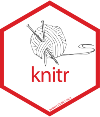

# An Overview

Before we get busy downloading and installing the actual software, here is the big picture.

-------------------------------

## R vs. R Studio

First time users often confuse by all the different uses of the letter "R". 

| $R$ | $R Studio$ |
| ---|-----------|
| Engine | Dashboard |
| Install and Ignore | Interact with Constantly | 
| {width=500px} | {width=500px} |

> More precisely, $R$ is a *programming language* that runs computations while $R Studio$ is an *integrated development environment (IDE)* that provides an interface by adding many convenient features and tools. So the way of having access to a speedometer, rearview mirrors, and a navigation system makes driving much easier, using $RStudio’s$ interface makes using $R$ much easier as well.  - [Chester Ismay and Albert Y. Kim](https://ismayc.github.io/moderndive/index.html)

For a more in-depth discussion on the difference between $R$ and $R Studio$ IDE, watch this [DataCamp video (2m52s)](https://campus.datacamp.com/courses/working-with-the-rstudio-ide-part-1/orientation?ex=1).

-------------------------------

## R Markdown vs. R Notebook

-------------------------------

## The Magic of Knit'ing

 
> $R Markdown$ documents are fully reproducible. Use a productive **notebook** interface to weave together narrative text and code to produce elegantly formatted output. Use multiple languages including $R$, $Python$, and $SQL$ [@R-rmarkdown].

> `knitr` is an engine for dynamic report generation with $R$. It is a package in the statistical programming language $R$ that enables integration of **R code** into $LaTeX$, $LyX$, $HTML$, $Markdown$, $AsciiDoc$, and $text$s documents [@R-knitr].

----------------

\begin{rmdtip}
\emph{Helpful Website:}
\href{https://www.statmethods.net/stats/index.html}{Quick R: Basic
Statistics}
\end{rmdtip}

