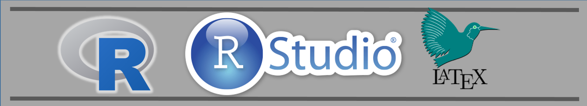
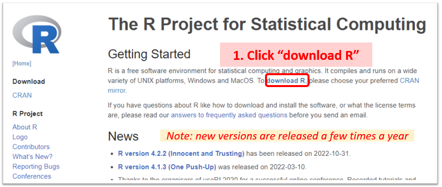
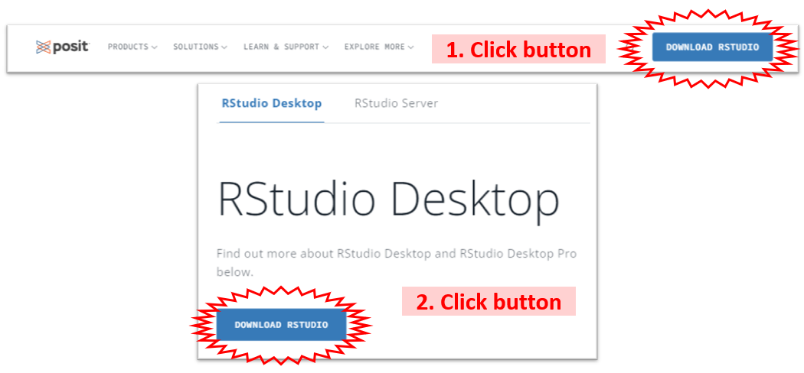

# Install Software

You will need to install both $R$ and $R Studio$, but $\LaTeX$ is optional.

## The R Programing Language

> The **“Comprehensive R Archive Network” (CRAN)** is a collection of sites which carry identical material, consisting of the $R$  distribution(s), the contributed extensions (packages), and documentation for $R$.  From $CRAN$, you can obtain the latest official FREE release of BASE $R$.

Go to: <a href="http://www.r-project.org">www.r-project.org</a>

<ul>
<li>Choose a CRAN mirror close to your geographical location 
</li>
<li>Select <strong>base</strong> \(R\) for your computer <em>(Windows, Mac, ect.)</em> 
</li>
<li>Once it is downloaded, run the instalation. 
</li>
<li>The defaults are good...don't change them...just keep clicking <em>'Next'</em></li>
</ul>

{width=600px}

{width=600px}

{width=600px}

{width=600px}

The \(R\) Project website has an extensive <a href="https://cran.r-project.org/doc/FAQ/R-FAQ.html">FAQ</a>

Each new release of \(R\) is given a name that references a Peanuts strip or film. Read some of the past names and find out where they came from: <a href="https://livefreeordichotomize.com/2017/09/28/r-release-names/">blog post</a>

---------------------------------

## The R Studio IDE

> **RStudio** is a company that is also an active member of the $R$ community. They believe free and open source data analysis software is a foundation for innovative and important work in science, education, and industry. Their namesake software, $RStudio$, is an integrated development environment (IDE) for $R$. It includes a console, syntax-highlighting editor that supports direct code execution, as well as tools for plotting, history, debugging and workspace management. 

Go to: <a href="http://www.rstudio.com">www.rstudio.com</a>

<ul>
<li>Select the FREE Open Source <strong>Desktop</strong> Edition of \(R Studio\)</li>
<li>The defaults are good...don't change them...just keep clicking <em>'Next'</em></li>
</ul>

{width=600px}

{width=600px}

{width=600px}

\(R Studio\) has an entire <a href="https://www.rstudio.com/online-learning/">online learning library</a>. It is full of helpful links and resources for R programing, R markdown, and statistics.

<strong>Note:</strong> The <a href="https://www.r-consortium.org/">\(R Consortium\)</a> is a collaboration between the \(R\) Foundation, \(RStudio\), \(Microsoft\), \(TIBCO\), \(Google\), \(Oracle\), \(HP\) and others. It’s chartered to fund and inspire ideas that will enable \(R\) to become an even better platform for science, research, and industry.

---------------------------------

## TeX (optional)

> $\TeX$ or $LaTeX$ is a typesetting or formatting system that is commonly used in printing and publishing, especially anything with formulas (see https://texfaq.org/FAQ-whatTeX).  It is NOT NEEDED to run $R$, but $R Studio$ must have access to it in order to `knit` a $R Notebook$ into a `.pdf` file.  There are many versions, but the following are the ones that work best with $R$, depending on your computer's platform.

### Mac - use `MacTeX`

Go to: <a href="http://tug.org/mactex/" class="uri">http://tug.org/mactex/</a>

<ul>
<li>Download (5+ min) to a folder and them double click on the <strong>PKG file</strong></li>
<li>Follow the installation instructions.</li>
<li>You don't need to open anything after MacTeX is finished installing.</li>
</ul>

{width=600px}

### Windows - use `MikTeX`

Go to: <a href="http://miktex.org/download" class="uri">http://miktex.org/download</a>

<ul>
<li>Pick the latest version of the <strong>Net Installer</strong>, not the Basic! 
</li>
<li>You need the full version 64-bit is better, if you have a 64-bit machine 
</li>
<li>When your download is complete, run the downloaded installer. 
</li>
<li>Windows may ask you if you want to <em>“allow this app from an unknown publisher to make changes to your PC”</em>. If it does, make sure to click <strong>Yes!</strong> 
</li>
<li>This is the slowest part...</li>
</ul>

{width=600px}

### New Option: the `tinytex` package???
 
 
`tinyteX` is still a relatively new project which strives to offer all the functionality of $\LaTeX$, but remain lightweight and easier to maintain.  As it is so new, we are not adopting it currently, but keeping an eye on what is to come.

Keep an eye on the developing <code>tinytex</code> package by checking back to it's <a href="https://yihui.name/tinytex/">home page</a>.

