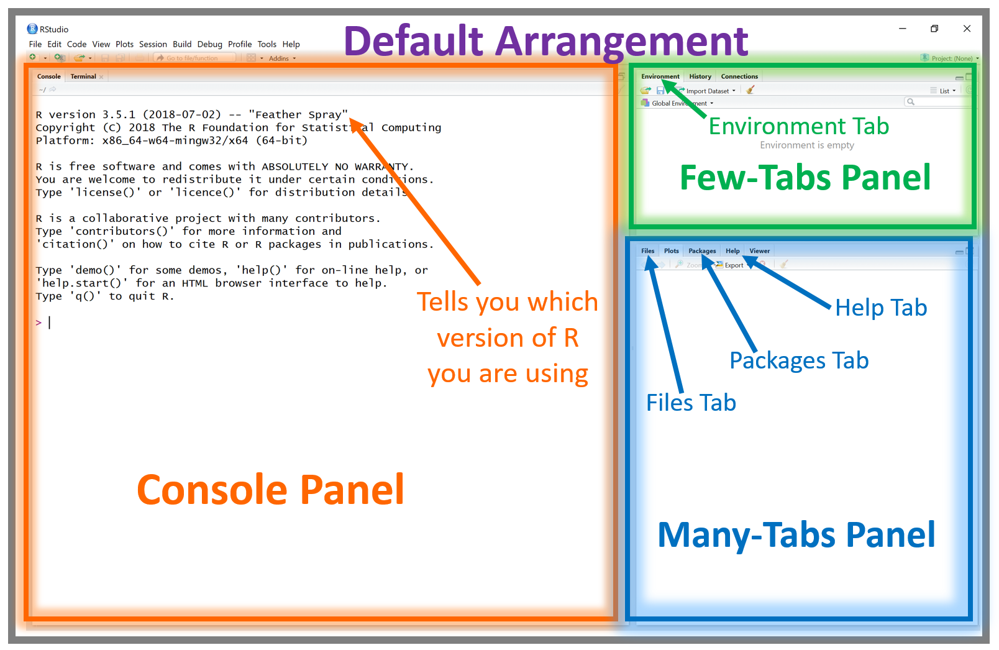

# Workspace Orientation

Get a feel for the lay of the land.

<strong>ADD SECTION:</strong> This chapter has not been started yet.

-----------------------

## Default Window Arrangement

{width=600px}

-----------------------

## Cheatsheets

{width=600px}

{width=600px}

-----------------------

## Global Options Menu

{width=600px}

### Pane Layout

{width=400px}

### Appearance

{width=400px}

{width=600px}

-----------------------

## Various Tabs

### Files

### Packages

### Help 

### Environment

