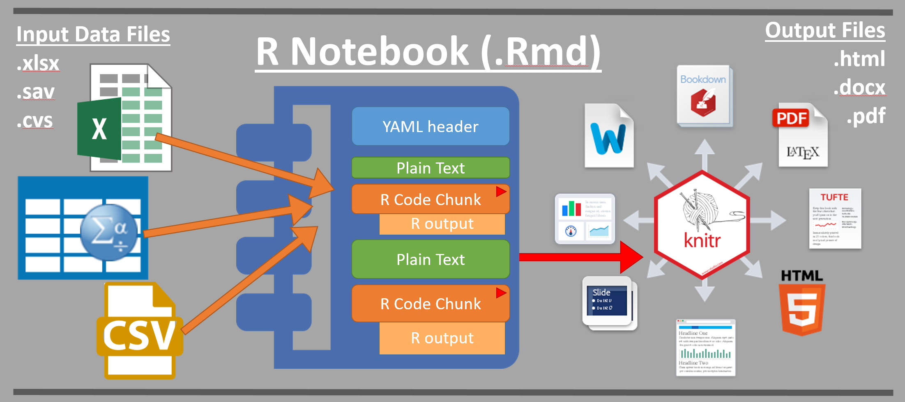

# Notebook Workflow

Dive in feet first and create your first R Notebook.

<strong>ADD SECTION:</strong> this chapter needs lots of attention.

## Create a New Notebook 

### YAML header

### Plain Text

### Code Chunks

---------------------------------

## Interact within a Notebook

### Run Code Chunks

### Chunk Options

---------------------------------

## Knit a Notebook

### Storing all associated files 

If you are using any files, such as *datasets* or *images*, they need to be stored in the same folder location as the R Notebook (`.Rmd` file).

This folder location must be the **Working Directory** for the R Studio session.  If you opened your `.Rmd` notebook file by double-clicking on its name, then this should be the case.  

### Setting the working directory

To ensure that R Studio knows where to find the files, you can manually set the **Working Directory** through the menu:

* Click `Session`
* Select `Set Working Directory` by hovering your mouse over it
* Click on `To Source File Location`

{width=600px}

You can double check that you were successful by 

* Click on the `Files` tab in the many-tab panel
* Click on the button with the gear that says `More`
* Click `Go To Working Directory`

At this point you should see all the files that reside in the folder location where the open `.Rmd` files is also saved. 

{width=600px}

### Press Knit
