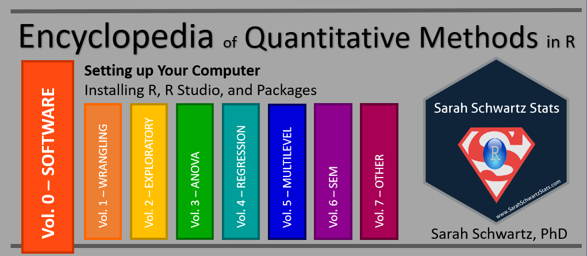

--- 
title: "Encyclopedia of Quantitative Methods in R, vol. 0: Setting up Your Computer"
author: "Sarah Schwartz, PhD"
date: "Last updated: `r Sys.Date()`"
documentclass: book
description: "Getting started with R and R Studio: installing software and package management."
knit: "bookdown::render_book"
cover-image: "EQM_v0_cover.png"
github-repo: cehs-research/eBook_install
site: bookdown::bookdown_site
output:
  bookdown::gitbook:
    split_bib: false
bibliography: [book.bib, packages.bib]
biblio-style: "apalike"
link-citations: yes
---


# Welcome {-}

[Encyclopedia's Home Website](https://cehs-research.github.io/eBooks/).





Website: www.SarahSchwartzStats.com](http://www.sarahschwartzstats.com/)  

eMail: Sarah.Schwartz@usu.edu

{width=400px}


## Why choose R ?  {-}


```{block type='rmdlink', echo=TRUE}
**Check it out:** an article from Fall 2016... [No more excuses: R is better than SPSS for psychology undergrads, and students agree](https://datahowler.wordpress.com/2016/09/10/no-more-excuses-r-is-better-than-spss-for-psychology-undergrads-and-students-agree/)
```


## FYI  {-}

This entire encyclopedia is written in $R Markdown$, using $R Studio$ as the text editor and the `bookdown` package to turn a collection of markdown documents into a coherent whole. The book's source code is hosted on GitHub. If you notice typos or other issues, feel free to email either of the authors.

This work is licensed under the [Attribution-NonCommercial-NoDerivatives 4.0 International](https://creativecommons.org/licenses/by-nc-nd/4.0/legalcode) License. 


{width=300px}
