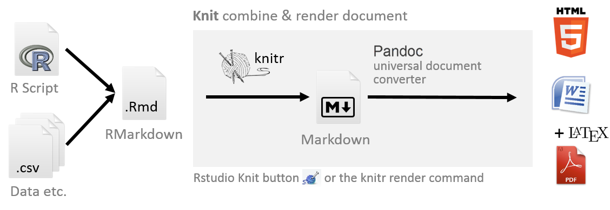

--- 
title: "Encyclopedia of Quantitative Methods in R, vol. 0: Setting up Your Computer"
author: "Sarah Schwartz & Tyson Barrett"
date: "Last updated: `r Sys.Date()`"
site: bookdown::bookdown_site
output:
  bookdown::gitbook:
    split_bib: false
documentclass: book
bibliography: [book.bib, packages.bib]
biblio-style: apalike
link-citations: yes
github-repo: cehs-research/eBook_install
description: "Getting started with R and R Studio: installing software and package management."
url: https://github.com/CEHS-research/eBook_install
cover-image: "EQM_v0_cover.png"
---

# Welcome {-}

## Preface {-}

This encyclopedia of eBooks is being developed by [Sarah Schwartz](http://www.sarahschwartzstats.com/) and [Tyson Barrett](http://tysonbarrett.com/), of the [Office of Research Services](https://cehs.usu.edu/research/index), to support faculty and graduate students in the [College of Education and Human Services](https://cehs.usu.edu/) at [Utah State University](http://www.usu.edu/).  It serves as reference material for graduate courses (EDUC/PSY 6600, EDUC/PSY 7610, PSY 7650, ect.), as well as college wide workshops and individualized consultation from the [Statistical Consulting Studio](https://cehs.usu.edu/research/statstudio/index) and the [Data Science and Discover Unit](https://cehs.usu.edu/research/dsdu/index).

-------------

## Background FAQs {-}

### What is R ? {-}

> $R$ is a language and environment for statistical computing and graphics. [@R-base]

$R$ provides a wide variety of **statistical** *(linear and nonlinear modelling, classical statistical tests, time-series analysis, classification, clustering, ...)* and **graphical** techniques, and is highly extensible. The $S$ language is often the vehicle of choice for research in statistical methodology, and $R$ provides an Open Source route to participation in that activity.

One of $R$’s strengths is the ease with which well-designed publication-quality plots can be produced, including mathematical symbols and formulae where needed. Great care has been taken over the defaults for the minor design choices in graphics, but the user retains full control.

-------------------------

### What is R Markdown ? {-}

According to [R Studio](www.rstudio.com):

> "R Markdown is a format that enables easy authoring of reproducible web reports from R. It combines the core syntax of Markdown (an easy-to-write *plain text* format for web content) with embedded *$R$ code chunks* that are run so their output can be included in the final document".

-------------------------------

### What is Dynamic Reporting? {-}

From [Penn State Statistics](https://onlinecourses.science.psu.edu/statprogram/markdown): 

The traditional way to write a report:

1. Run your analysis in software, like SPSS or R and manually save our output
    * *i.e. saving the ANOVA table or using `pdf()` to save the graphs*  

2. Type your your description and interpretation in a text editor like *Word*
    * *either drag/drop tables and figures, or worse copy-paste and retype all the numbers*

A report written in this way can be problematic.  For instance, imagine your *Mentor/collaborator/journal reviewer*  telling you that they want to use a sub-sample instead of the entire sample. Or to include a nother variable.  You would have to redo all of your work!! 

Therefore, in this way **dynamic also means reproducible**, in the sense that people who get the file from you can reproduce the entire work in the report.

-------------------

### How does R Markdown work out to be a `.pdf` or `.html` file? {-}

$R Markdown$ is a file with the file extension `.Rmd`, the `knitr` package will then transform the file into a *Markdown* file with the extension `.md.` Then $R Studio$ can [@xie2015]:

  * Use $LaTeX$ to transform the file into a `.pdf` 
    
  * Load another package called $markdown$ to transform the file into `.html`   
    
  * Use Pandoc to even convert to file to a `Word` document (ugly)

The professionals ar $R Studio$ show it better at their [website](https://rmarkdown.rstudio.com/index.html).

----------------------

### Is this a popular method for creating reports? {-}

Check out [Rpubs](http://rpubs.com/). This website shares lots of documents written in the way we will introduce below.

